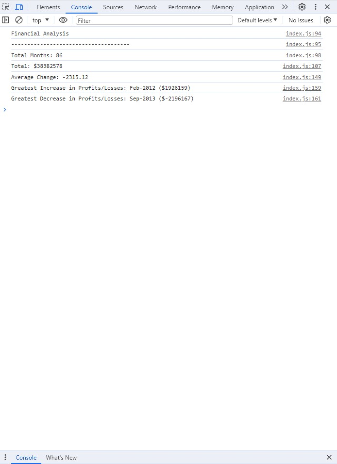

# Console-Finances

[Click to view deployed application](https://cariberrii.github.io/Console-Finances)

## Description
 
 The code I've written in this project utilizes information provided in a dataset including the Date and Profit/Losses over a period of 86 months. As my first deployed JavaScript code, the challenge to calculate and output the correct figures for a number of targets signifies comprehension of my very first programming language.

 The task is to calculate the total number of months included in the dataset, net total amount of Profit/Losses over the entire period, average of the changes,greatest increase and greatest decrease in profits (date and amount).

 Since the targets require numeric results, there is one definite answer to each and definitively proves the code written functions correctly. I first thought that I would need to write multiple for loops, but quickly realized the iterations of the array can perform more than one condition as it goes. It also became clear to me that I should declare all variables used for logging to the console before the for loop as they are dependent upon the results of each iteration and change accordingly. 
 
 If I have learned anything by now, it's the more challenging the language and task at hand, the more rewarding the results. In addition, it's becoming a mental habit to remember the growth mindset and take a break when I'm stuck. For instance, once I figured out the code to calculate the difference between Profit/Losses month to month, I had no idea how I was going to create a new array with the new information to find the total of all differences to then calculate the average. So I stepped away and reminded myself that I don't know yet, maybe it's more simple than that. When I came back to it, I actually played some coding games using JavaScript to continue my learning journey. Low and behold, my brain managed to wrap around the simple concept I used to complete each task. 

 In summation, I'm continuing to learn that coding can be challenging, coding can be fun, and coding can be a a massively rewarding habit. 

## Table of Contents

- [Console Screenshot](#console-screenshot)
- [Credits](#credits)
- [License](#license)

## Console Screenshot

## Credits

Tutorials:

Geeks for Geeks: JavaScript Array Reference:

https://www.geeksforgeeks.org/javascript-array-reference/?ref=shm

Stack Overflow: Rounding to the nearest hundredth for currencies in javascript:

https://stackoverflow.com/questions/49802673/rounding-to-the-nearest-hundredth-for-currencies-in-javascript

CodinGame: Learn Loops:

https://www.codingame.com/learn/loops

CodinGame: Learn Arrays:

https://www.codingame.com/learn/arrays

## License

MIT License

Copyright (c) 2023 Cari Fillingham

Permission is hereby granted, free of charge, to any person obtaining a copy
of this software and associated documentation files (the "Software"), to deal
in the Software without restriction, including without limitation the rights
to use, copy, modify, merge, publish, distribute, sublicense, and/or sell
copies of the Software, and to permit persons to whom the Software is
furnished to do so, subject to the following conditions:

The above copyright notice and this permission notice shall be included in all
copies or substantial portions of the Software.

THE SOFTWARE IS PROVIDED "AS IS", WITHOUT WARRANTY OF ANY KIND, EXPRESS OR
IMPLIED, INCLUDING BUT NOT LIMITED TO THE WARRANTIES OF MERCHANTABILITY,
FITNESS FOR A PARTICULAR PURPOSE AND NONINFRINGEMENT. IN NO EVENT SHALL THE
AUTHORS OR COPYRIGHT HOLDERS BE LIABLE FOR ANY CLAIM, DAMAGES OR OTHER
LIABILITY, WHETHER IN AN ACTION OF CONTRACT, TORT OR OTHERWISE, ARISING FROM,
OUT OF OR IN CONNECTION WITH THE SOFTWARE OR THE USE OR OTHER DEALINGS IN THE
SOFTWARE.